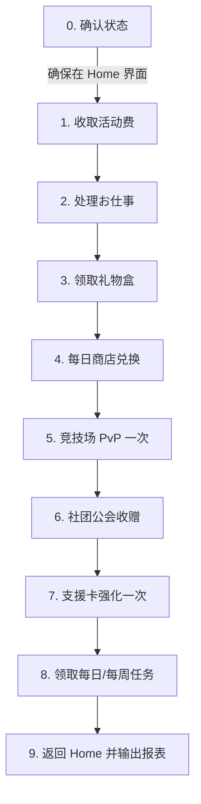

# GakumasAuto Agent Operational Guide (Agent.md)

面向 AI Agent（Claude Code、Cursor、Roo Code、Harness 等）的《学园偶像大师》自动化控制核心规范与运行指南。

---

## 1. 架构与交互模型

```text
┌─────────────────────────────────────────────────────────────────────────┐
│                           AI Agent (Brain)                              │
│         - 阅读 Agent.md 与 .agent/skills/ 获取任务流程与避坑规则           │
│         - 通过 MCP 协议 (stdio) 或 直接通过 Node 执行 mcp/tool.js 调度    │
└────────────────────────────────────┬────────────────────────────────────┘
                                     │ JSON-RPC 2.0 / Node API
                                     ▼
┌─────────────────────────────────────────────────────────────────────────┐
│                    mcp/server.js (MCP 服务与任务编排层)                   │
│         - 提供 L0感知 / L1动作 / L2数据 / L3任务 级工具抽象             │
│         - 支持 Node 直调: const { callTool } = require('./mcp/server')  │
│         - CLI 工具直调: node mcp/tool.js <tool_name> [args]            │
└────────────────────────────────────┬────────────────────────────────────┘
                                     │ 本地文件原子读写 (gakumas-ui-cmd/resp.json)
                                     ▼
┌─────────────────────────────────────────────────────────────────────────┐
│               plugin/GakumasAuto.dll (BepInEx 6 进程内插件)             │
│         - 运行于 Unity 主线程，通过 Il2CppInterop 直读内存与 Presenter  │
│         - 支持原生 UI 遍历 (Layout/Find)、指针模拟 (Tap/Click)、回调直调 │
└────────────────────────────────────┬────────────────────────────────────┘
                                     ▼
                        gakumas.exe (Unity 游戏本体)
```

---

## 2. 交互模式与执行方式

Agent 可根据自身环境采用以下两种模式驱动游戏：

### 模式 A：标准 MCP Tool Calling（推荐用于日常对话式自动化）
宿主配置 `.mcp.json` 后，Agent 直接调用挂载的 `mcp__gakumas_*` 工具。

### 模式 B：Node.js 直调模式（测试与高性能自动化，节省 Tool Round-trips）
当需要快速验证、批量执行或不消耗 LLM 工具调用轮次时，Agent 或用户可直接使用命令行执行：
```bash
# 1. 查询所有已注册的 MCP 工具列表
node mcp/tool.js

# 2. 调用感知与数据工具
node mcp/tool.js state
node mcp/tool.js account
node mcp/tool.js daily_state
node mcp/tool.js mission_list category=Daily
node mcp/tool.js support_list
node mcp/tool.js pvp_state
node mcp/tool.js exchange_items

# 3. 屏幕路由跳转
node mcp/tool.js screen_goto home
node mcp/tool.js screen_goto pvp
node mcp/tool.js screen_goto mission

# 4. 执行带确认的高级任务
node mcp/tool.js daily_collect_money
node mcp/tool.js daily_finish_outing
node mcp/tool.js daily_set_outing confirm=true
node mcp/tool.js pvp_challenge rival=low confirm=true
node mcp/tool.js support_upgrade confirm=true
node mcp/tool.js mission_receive
node mcp/tool.js exchange_buy name="ロジックノート" confirm=true

# 5. 底层动作模拟
node mcp/tool.js tap_at x=270 y=140
node mcp/tool.js invoke_callback "Canvas/FullScreen/BackgroundAsset/StartButton"
node mcp/tool.js find "ExecuteButton"
```

---

## 3. 技能路由表（Skills Index）

技能文件存放于 `.agent/skills/` 目录，涵盖游戏的核心自动化场景：

| 技能名称 | 对应目录 | 触发关键词 | 核心流程与职责 |
|---|---|---|---|
| **gakumas-daily** | `.agent/skills/gakumas-daily/` | 日常, 每日, daily, 收活动费 | 完整日常闭环：活动费、お仕事收发、礼物、商店购买、竞技场、社团、支援卡强化、每日任务领取 |
| **gakumas-produce** | `.agent/skills/gakumas-produce/` | 培育, 育成, produce, 考试打牌 | 完整 Produce 闭环：入场、日程选择（课程/外出/购物/休息）、特别指导、考试手牌推荐出牌、ADV 快进 |
| **gakumas-contest** | `.agent/skills/gakumas-contest/` | 竞赛, コンテスト, PvP, 竞技场 | 竞技场对战：进场、未编成时自动编成、挑选对手挑战、跳过战斗序列、领取奖励 |
| **gakumas-club** | `.agent/skills/gakumas-club/` | 社团, 俱乐部, 笔记请求, 捐赠 | 社团公会：领取募集完成奖励、发起新笔记募集、向成员捐赠礼物（至多 5 次） |
| **gakumas-shop** | `.agent/skills/gakumas-shop/` | 商店, 兑换, 每日交换所, 周礼包 | 商店兑换：每日マニー交换所推荐商品购买、AP 商店商品、钻石商店每周免费礼包 |
| **gakumas-support** | `.agent/skills/gakumas-support/` | 支援卡, 升级支援卡 | 支援卡强化：自动筛选未满级且等级最低的卡牌，进入详情强化 1 次完成日常任务 |
| **gakumas-capsule** | `.agent/skills/gakumas-capsule/` | 扭蛋, 硬币扭蛋, capsule | 硬币扭蛋机：friend/sense/logic/anomaly 扭蛋状态读取与抽卡（默认跳过，仅按用户指令执行） |

---

## 4. 安全合约与确认规范（Safety Contract）

涉及消耗虚拟资产的操作必须显式传入 `confirm: true`，防止意外消耗资源：

- **消耗マニー/道具/体力**：
  - `daily_set_outing`：确认派遣外出。
  - `exchange_buy`：购买交换所道具。
  - `pvp_challenge`：消耗每日竞技场门票。
  - `club_request`：发起社团求助。
  - `club_donate`：捐赠笔记。
  - `capsule_draw`：消耗扭蛋硬币抽卡。
  - `support_upgrade`：消耗强化点数升级支援卡。
  - `shop_buy_item`：钻石/礼包商店购买（严禁擅自消耗付费或免费宝石，仅限 `isFree: true` 商品）。
- **确认原则**：若未传入 `confirm: true`，对应工具将以 Dry-run 模式运行或直接抛出 `CONFIRM_REQUIRED` 异常。

---

## 5. 核心状态机与全局避坑准则

### 5.1 标题画面与登录恢复（Title TAP TO START）
- 当 `state.screen == ""` 且 `find StartButton` 匹配到 `Canvas/FullScreen/BackgroundAsset/StartButton` 时为标题画面。
- **恢复指令**：调用 `invoke_callback Canvas/FullScreen/BackgroundAsset/StartButton` **仅一次**。
- **严禁**：在 Loading 动画期间连续高频点击 StartButton，会导致 Unity 协程堆栈异常甚至闪退。
- 等待 `state` 中 `userId` 非空且 `screen == "home"` 即完成登录。

### 5.2 通信错误恢复（ErrorSheet / 通信エラー）
- 界面弹出「通信エラー」时，UI 树中会出现 `Canvas/ErrorSheet(Clone)`。
- **重试**：优先调用 `invoke_callback Canvas/ErrorSheet(Clone)/Canvas/UIContentArea/SheetMoveRoot/SheetRoot/Buttons/ExecuteButton`（右侧「リトライ」）。
- **返回标题**：若重试无效，调用左侧 `CancelButton`（「タイトルへ」），等待回到标题画面后再单次点击 StartButton。

### 5.3 弹窗与确认框关闭准则
- 操作完成（如受取完了、購入完了、强化完了）：统一使用 `CancelButton`（閉じる）关闭。
- **严禁**：在空白弹窗层或已关闭的对话框上误点 `ExecuteButton`，否则可能触发空指针异常（NRE）导致游戏掉出到标题画面。

### 5.4 界面跳转安全性（Screen Goto Safety）
- 在支援卡详情（`screen=support_detail`）等特定子界面中，禁止直接调用 `screen_goto home`，否则底层 `CancellationTokenOnDestroy` 异常可能导致崩溃回标题。
- **安全路径**：先点击返回按钮 `BackButton` 退回列表页，再执行 `screen_goto home`。

### 5.5 Stuck NOW LOADING 恢复
- 若游戏卡在加载遮罩层，导致底部 Tab 或返回按钮无法响应：
- 调用 `loading_hide`（底层执行 `LoadingManager.HideImmediate`）强行解除遮罩，再执行 `screen_goto home`。

---

## 6. 标准日常任务执行流（Standard Daily Routine）

日常自动化标准执行顺序：



1. **0. 状态检查**：调用 `state`，确保 `userId` 正常且处于 `screen=home`。
2. **1. 活動費**：调用 `daily_collect_money`，收取主界面累计マニー。
3. **2. お仕事**：调用 `daily_state`，若有已完成工作调用 `daily_finish_outing`；若可派出调用 `daily_set_outing confirm=true`。
4. **3. プレゼント**：调用 `gift_receive confirm=true` 一键领取，关闭完成弹窗。
5. **4. 商店**：调用 `exchange_items`，购买 `recommend: true` 的道具（如ロジック/センス笔记）。
6. **5. 竞技场**：调用 `pvp_enter`，挑战一次 low/middle 对手，跳过战斗并领取胜利结算。
7. **6. 社团**：调用 `club_enter`，领取募集奖励，向成员捐赠礼物（至多 5 次）。
8. **7. 支援卡**：调用 `support_upgrade confirm=true`（3次确认流程）将最低级支援卡提升 1 级。
9. **8. 任务结算**：调用 `mission_receive` 打开任务页并执行一键领取；若有未领完的调用 `invoke_callback ScreenHeaderFooterCanvas/ContentArea/SlideRoot/ReceiveAllButton`。
10. **9. 收尾**：调用 `screen_goto home`，输出任务完成情况表格。

---

## 7. 开发者与测试调试指南

- **启动游戏**：
  使用 DMM 授权命令启动游戏：
  `E:\DMM\gakumas\gakumas.exe /viewer_id=<id> /open_id=<open_id> /pf_access_token=<token>`
- **重新编译插件**：
  ```bash
  dotnet build plugin/GakumasAuto.csproj -c Release
  ```
- **部署插件**：
  在游戏关闭状态下，将 `plugin/bin/Release/net6.0/GakumasAuto.dll` 复制至 `E:\DMM\gakumas\BepInEx\plugins\GakumasAuto.dll`。
- **日志观察**：
  游戏运行日志位于 `E:\DMM\gakumas\BepInEx\LogOutput.log`。
